# Contract Bulk Analyzer


**Copyright (c) 2025 Marco De Roni. All rights reserved.**  
Licensed under the [MIT License](LICENSE).

---

## Overview

Contract Bulk Analyzer is a Python tool for cross-contract analysis.  
Load a folder of PDF and DOCX contracts and get instant aggregate insights:
keyword frequency, clause presence rates, metadata extraction, and  
group-based comparisons — all exported to Excel and Word automatically.

Built by a Senior Commercial Legal Counsel with EMEA experience in SaaS  
enterprise contracting, GDPR compliance, and risk assessment.

Companion project to [Contract Scanner](https://github.com/marcoderoni/Contract-Scanner)  
— which generates a detailed per-contract risk report.

---

## Features

- 🔍 **Keyword frequency** — how many contracts contain a given word or phrase
- 📋 **Clause presence** — % of contracts with/without a specific clause
- 📊 **Metadata extraction** — parties, governing law, notice period, duration,  
  auto-renewal across all contracts in one table
- 🔀 **Group comparison** — compare clause presence between contract types  
  (e.g. vendor vs customer contracts)
- 📊 **Excel output** — multi-sheet workbook with color-coded results
- 📝 **Word output** — summary report with tables and divergence highlights
- ⚙️ **No coding required** — define all queries in plain YAML
- 🔒 **PII sanitization** — automatically redacts names, dates, emails and other sensitive entities before sending to AI provider, then restores them in the final report

---

## Project Structure
```
contract-bulk-analyzer/
├── config/
│   ├── queries.example.yaml   # Template — copy and customise
│   └── queries.yaml           # Your queries (excluded from git)
├── contracts/                 # Drop your PDF/DOCX files here (excluded from git)
├── output/                    # Generated Excel + Word reports (excluded from git)
├── analyzer/
│   ├── extractor.py           # PDF and DOCX text extraction
│   ├── keyword_scan.py        # Keyword frequency analysis
│   ├── clause_scan.py         # Clause presence/absence detection
│   ├── metadata_scan.py       # Metadata extraction
│   ├── comparator.py          # Group-based contract comparison
│   └── reporter.py            # Excel and Word report generation
├── main.py                    # Entry point
├── requirements.txt           # Python dependencies
├── LICENSE                    # MIT License
└── README.md
```

---

## Getting Started

### 1. Clone the repository
```bash
git clone https://github.com/marcoderoni/contract-bulk-analyzer.git
cd contract-bulk-analyzer
```

### 2. Create and activate virtual environment
```bash
python3 -m venv venv
source venv/bin/activate        # Mac/Linux
venv\Scripts\activate           # Windows
```

### 3. Install dependencies
```bash
pip install -r requirements.txt
```

### 4. Set up your queries
```bash
cp config/queries.example.yaml config/queries.yaml
```

Edit `config/queries.yaml` to define your keywords, clauses, and groups.  
The file is excluded from git — your queries stay private.

### 5. Add contracts

Drop one or more `.pdf` or `.docx` files into the `contracts/` folder.  
The folder is excluded from git — your documents never leave your machine.  
You can analyse any number of contracts in a single run.

### 6. Run
```bash
python3 main.py
```

Results are printed in the terminal with colour coding, and two files  
are saved in `output/`: an Excel workbook and a Word report.

---

## How to Customise Queries

All analysis is driven by `config/queries.yaml`. No code changes needed.

### Search for keywords
```yaml
keywords:
  - "unlimited liability"
  - "auto-renewal"
  - "GDPR"
  - "termination for convenience"
```

Output: for each keyword, how many contracts contain it and what percentage.

### Check clause presence
```yaml
clauses:
  - name: "Limitation of Liability"
    keywords: ["liability cap", "cumulative liability", "limitation of liability"]
  - name: "Data Protection / GDPR"
    keywords: ["GDPR", "personal data", "data processing"]
```

Output: per-contract yes/no matrix + % presence across all contracts.

### Group contracts for comparison
```yaml
comparison_groups:
  - name: "Vendor Contracts"
    patterns: ["vendor", "supplier", "MSA"]
  - name: "Customer Contracts"
    patterns: ["customer", "client", "order form"]
```

Output: clause presence % per group + divergences highlighted  
(clauses where groups differ by more than 30%).

### Extract metadata
```yaml
metadata:
  parties_keywords: ["between", "entered into by"]
  governing_law_keywords: ["governed by", "governing law"]
  notice_keywords: ["days' notice", "written notice"]
  duration_keywords: ["term", "duration"]
  renewal_keywords: ["auto-renewal", "automatically renew"]
```

Output: one row per contract with all extracted fields in Excel.

---

## Example Terminal Output
```
=== Contract Bulk Analyzer ===

📂 Loading contracts...
   ✓ 12 contracts loaded

🔍 Keyword frequency scan...
   unlimited liability          3/12  (25.0%)
   auto-renewal                 9/12  (75.0%)
   GDPR                        11/12  (91.7%)

📋 Clause presence scan...
   Limitation of Liability     100.0%
   Data Protection / GDPR       91.7%  ← missing in: contract_03.pdf
   Force Majeure                41.7%

📊 Metadata extraction...
   ✓ Metadata extracted from 12 contracts

🔀 Group comparison...
   ⚠️  2 significant divergences found:
   Force Majeure: Customer Contracts 80% vs Vendor Contracts 20%

📝 Generating reports...
✅ Done!
   📊 Excel: output/bulk_analysis_20250323_1700.xlsx
   📝 Word:  output/bulk_report_20250323_1700.docx
```

---

## Privacy & Confidentiality

- `contracts/` is excluded from git — your documents never leave your machine
- `config/queries.yaml` is excluded from git — your queries stay private
- All processing is local — no data is sent to external APIs
- PII redaction via Microsoft Presidio — 900+ entities automatically anonymised per batch

---

## Requirements

- Python 3.9+
- pdfplumber
- python-docx
- pyyaml
- openpyxl
- colorama
- tqdm

---

## Related Project

**[Contract Scanner](https://github.com/marcoderoni/Contract-Scanner)**  
Single-contract review tool with R/Y/G risk scoring and detailed Word report.

---

## Author

**Marco De Roni**  
Senior Commercial Legal Counsel | EMEA  
[LinkedIn](https://linkedin.com/in/marcoderoni) · [GitHub](https://github.com/marcoderoni)

---

## Demo



---

## License

MIT License — see [LICENSE](LICENSE) for details.